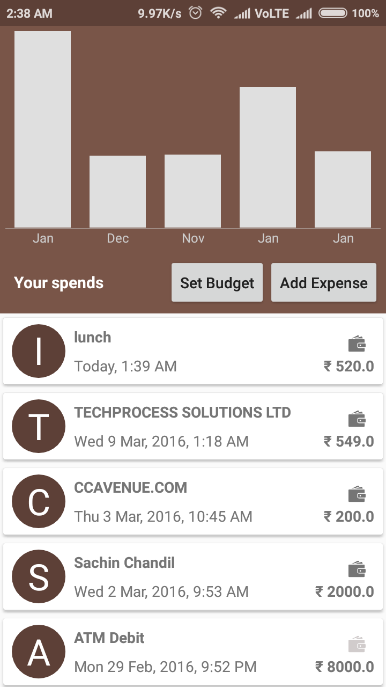
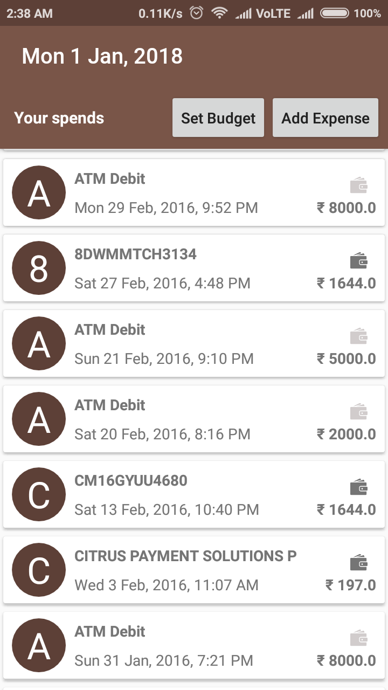
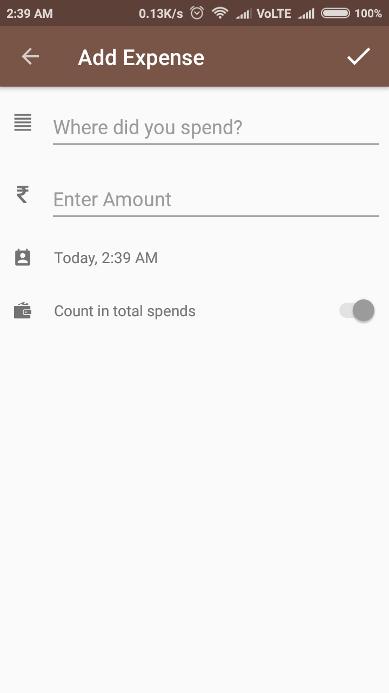
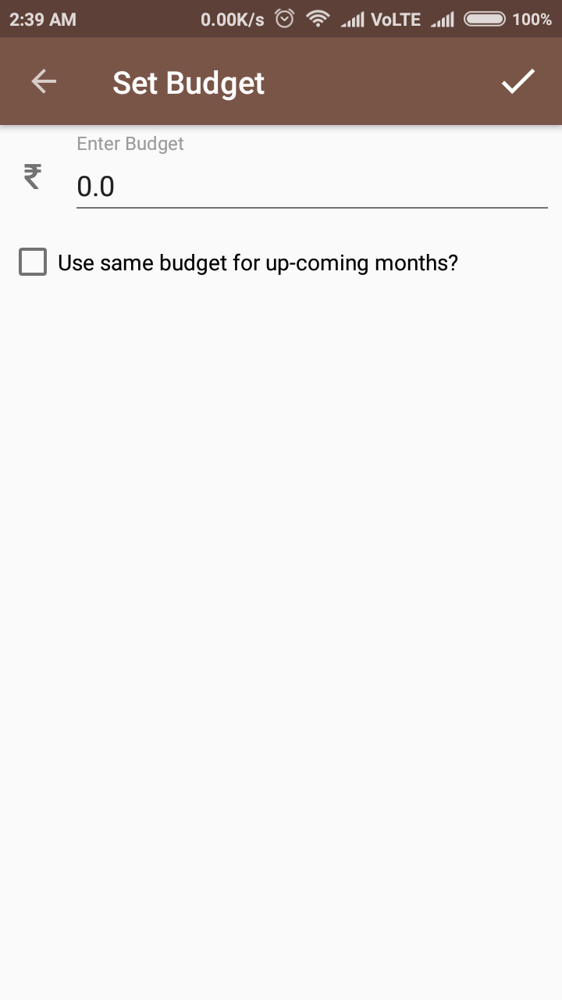
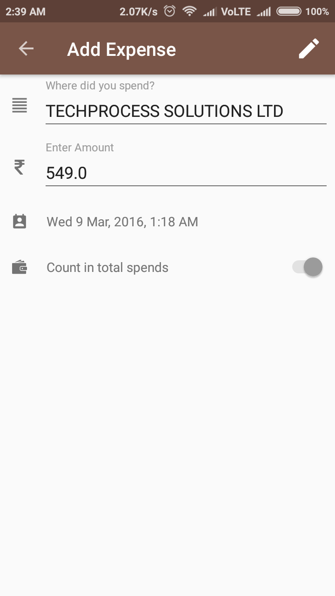

Bounty-Android-Personal-Finance
===============================

We are all on a tight budget. We know we need to be saving money but we just don't know where it disappears. It's first of the month, I have received my salary ... It's 5th of the month, and most of it has disappeared!

Doesn't this sound familiar? The first step is to bring in visibility into your income and expenses. Instead of manually inputing this data, we can extract this data from SMS and emails.

This is Simple (yet functional) Personal Finance app in Android written in Kotlin. 

### Language used
1. Kotlin
1. Java

### Libraries used
1. Android Architecture Components
1. Room Persistence
1. RxJava2
1. Dagger2
1. Hellocharts-android (Graph)

#### Instructions to run the app:
1. Download the code.
1. Open the project in Android Studio 3.0 or later.
1. Let it download artifacts.
1. Run the app.

#### Yet to complete points
1. Yearly graph, monthly graph representation
1. Budget implementation, setting/updating budget for month wise (save in database)
1. Pagination for expense list
1. Expense list for month/year wise 
1. Improve expense information extraction algorithm from SMS
1. Add Category for expense
1. Add Firebase database

#### Things not working properly (Half cooked)
1. Graph representation of expense
1. Add Budget
1. Expense information extraction algorithm from SMS (Only works for Axis bank for now)

#### Screenshots

